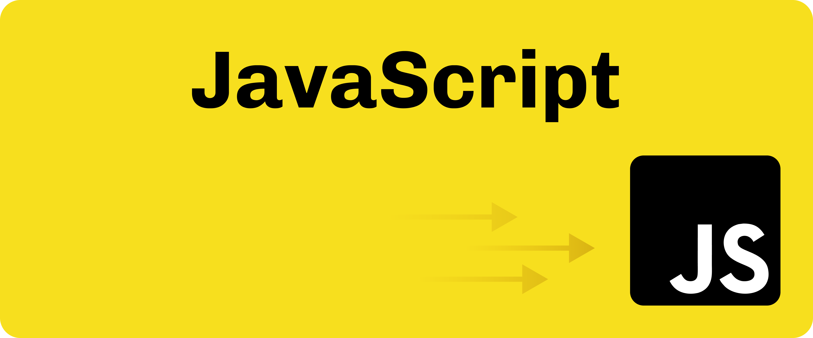
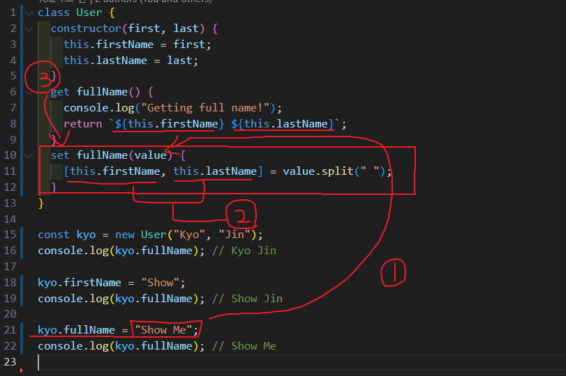

`by Kyojin Hwang`

<br/>

## 📚카테고리 (Category)

1. [Prototype](#📌-Prototype)
1. [class 기본문법](#📌-Class-기본문법)
1. [getter setter](#📌-Getter,-Setter)
1. [정적메소드](#📌-정적메소드)
1. [상속 & instanceof](#📌-상속과-instanceof)
1. [class 상속](<#📌-instanceof-와-constructor-(Class-상속)>)

<br/>

## 📌 Prototype

**Prototype이란?🧐**

- 자바스크립트의 모든 객체는 자신의 `부모 역할`을 담당하는 `객체와 연결`되어 있다. 그리고 이것은 마치<br/>`객체 지향의 상속 개념`과 같이 부모 객체의 `프로퍼티` 또는 `메소드`를 `상속`받아 사용할 수 있게 한다.<br/>이러한 부모 객체를 `Prototype(프로토타입) 객체` 또는 줄여서 `Prototype(프로토타입)`이라 한다.

```javascript {numberLines}
// prototype

// 잠깐 리터럴이란?🧐
// 리터럴은 데이터(값) 그 자체를 뜻한다. 즉, 변수에 넣는 변하지 않는 데이터를 의미하는 것.
// 객체리터럴, 배열리터럴 등등 여러가지가 있다.

// 여기서 fruits 는 new Array를 통한 instance 이다.
const fruits = new Array("Apple", "Banana", "Cherry");

console.log(fruits); // (3) ['Apple', 'Banana', 'Cherry']
console.log(fruits.length); // 3
console.log(fruits.includes("Banana")); // true
console.log(fruits.includes("Melon")); // false

// 프로토타입 속성에서 우리가 인위적으로 만드는 어떤 메소드는
// 기본적으로 function 키워드를 사용하는 일반 함수를 써준다.
Array.prototype.kyojin = function () {
  console.log(this); // this는 fruits를 가리킨다.
};

fruits.kyojin(); // (3) ['Apple', 'Banana', 'Cherry']

const arr = ["order"];
arr.kyojin(); // ['order]

--------------------------------------------------

// 🔊 리터럴 방식

const owen1 = {
  firstName: "Owen",
  lastName: "Cold",
  getFullName() {
    return `${this.firstName} ${this.lastName}`;
  },
};

const kyo1 = {
  firstName: "Kyo",
  lastName: "Jin",
};

// kyo는 owen 이라는 리터럴객체에서 getFullName을 빌려썻다.
console.log(owen1.getFullName.call(kyo1)); // Kyo Jin

// 🔊 생성자 함수 방식

function User(first, last) {
  this.firstName = first;
  this.lastName = last;
}

// 프로토타입에 공통함수 적용
User.prototype.getFullName = function () {
  return `${this.firstName}  ${this.lastName}`;
};

const owen2 = new User("Owen", "Cold");
const kyo2 = new User("Kyo", "Jin");

console.log(owen2);
console.log(kyo2);
console.log(owen2.getFullName());
console.log(kyo2.getFullName());

```

[📚Move](<#📚카테고리-(Category)>)
<br/>

## 📌 Class 기본문법

**Class란?🧐**

- 클래스의 이름은 `Korea`와 같이 대문자로 시작한다.
- 클래스는 반드시 정의한 뒤에 사용할 수 있다.
- 클래스 내에 정의된 함수를 `method`라고 부른다
- 클래스를 통해 생성된 객체를 `인스턴스(instance)`라고 부른다.
  ex) 인스턴스 = new Class()

**prototype**

```javascript {numberLines}
function User(first, last) {
  this.fristName = first
  this.lastName = last
}

User.prototype.getFullName = function () {
  return `${this.fristName} ${this.lastName}`
}

const kyo = new User('Kyo', 'Jin')
const owen = new User('Owen', 'Cold')

console.log(kyo) // User {firstName: 'Kyo', lastName: 'Jin'}
console.log(owen) // User {firstName: 'Owen', lastName: 'Cold'}

console.log(kyo.getFullName()) // Kyo Jin
console.log(owen.getFullName()) // Owen Cold
```

**class**

```javascript {numberLines}
class User {
  // constructor 는 위의 프로토타입에 function User 역할을 한다
  constructor(first, last) {
    this.firstName = first
    this.lastName = last
  }
  // 쉼표를 쓰지않고 함수를 바로 작성한다.
  getFullName() {
    return `${this.firstName} ${this.lastName}`
  }
}

const kyo = new User('Kyo', 'Jin')
const owen = new User('Owen', 'Cold')

console.log(kyo) // User {firstName: 'Kyo', lastName: 'Jin'}
console.log(owen) // User {firstName: 'Owen', lastName: 'Cold'}

console.log(kyo.getFullName()) // Kyo Jin
console.log(owen.getFullName()) // Owen Cold
```

[📚Move](<#📚카테고리-(Category)>)
<br/>

## 📌 Getter, Setter

Getter와 Setter 은 함수 호출 형식이 아닌, 일반 프로퍼티처럼 접근해서 사용된다.

<br/>

**예시1**

- New라는 키워드를 통해서 생성자 함수로 예시의 User클래스를 호출할 때 최초로 만들어지고
  그 다음부터는 firstName과 lastName이 바뀌더라도 전혀 변화가 되지않는다.

```Javascript {numberLines}
class User {
  constructor(first, last) {
    this.firstName = first;
    this.lastName = last;
    this.fullName = `${this.firstName} ${this.lastName}`;
  }
  getFullName() {
    return `${this.firstName} ${this.lastName}`;
  }
}

const kyo = new User("Kyo", "Jin");
console.log(kyo); // User {firstName: 'Kyo', lastName: 'Jin', fullName: 'Kyo Jin'}
console.log(kyo.getFullName()); // Kyo Jin

kyo.firstName = "Show";
// fullName이 바뀌지않는다. 그래서 getFullName의 메소드를 사용한다.
console.log(kyo); // User {firstName: 'Show', lastName: 'Jin', fullName: 'Kyo Jin'}
console.log(kyo.getFullName()); // Show Jin

```

**예시1을 업그레이드하기 위한 Getter Setter**

```javascript {numberLines}
class User {
  constructor(first, last) {
    this.firstName = first
    this.lastName = last
  }
  get fullName() {
    console.log('Getting full name!')
    return `${this.firstName} ${this.lastName}`
  }
  set fullName(value) {
    ;[this.firstName, this.lastName] = value.split(' ')
  }
}

const kyo = new User('Kyo', 'Jin')
console.log(kyo.fullName) // Kyo Jin

kyo.firstName = 'Show'
console.log(kyo.fullName) // Show Jin

kyo.fullName = 'Show Me'
console.log(kyo.fullName) // Show Me
```



<br/>

**예시1 업그레이드 사진설명**

1. 21번코드줄에서의 `kyo.fullName = "Show Me"`는 setfullName에 value로 들어간다.
2. 배열 구조분해할당으로 인해 this.firstName에는 `Show` this.lastName에는 `Me`가 들어간다.
3. 22번코드줄에서의 fullName은 getfullName이 되며 아래의 set을 조회한다.

<br/>

**Setter의 무한루프**

- 접근자 프로퍼티의 이름을 중복이 되도록 하면 안된다.

```javascript {numberLines}
const user = {
  name: "kyo",

  get name() {
    return user.name;
  },

  set name(value) {
    user.name = value;
  },
};

// user 객체의 name 프로퍼티 값을 변경
user.name = "owen";
// Error : Uncaught RangeError RangeError: Maximum call stack size exceeded

-------------------------------------------------

const user = {
  _name: "kyo",

  get name() {
    return user._name;
  },

  set name(value) {
    user._name = value;
  },
};

// user 객체의 name 프로퍼티 값을 변경
user._name = "owen";

console.log(user.name); // owen
```

[📚Move](<#📚카테고리-(Category)>)
<br/>

## 📌 정적메소드

**정적 메소드란?🧐**

- `정적 메소드`는 `클래스`로 호출한다 vs `프로토타입 메소드`는 `인스턴스`로 호출한다.

<br/>

**클래스 vs 인스턴스 메소드 차이**

```javascript {numberLines}
class Phone {
  constructor(number) {
    this.myNumber = number
  }
  introduce() {
    return console.log('프로토타입 메소드')
  }
  static isComplain() {
    return console.log('정적 메소드')
  }
}
// 인스턴스 생성
const user = new Phone(7788)

// 클래스
Phone.isComplain()
// 인스턴스
user.introduce()
```

**static 사용법**

```javascript {numberLines}
class User {
  constructor(first, last) {
    this.firstName = first;
    this.lastName = last;
  }
  getFullName() {
    return `${this.firstName} ${this.lastName}`;
  }
  // 직접적으로 사용하는 메소드를 만들고 싶을떄는 static
  static isUser(user) {
    return true;
  }
}

const kyo = new User("Kyo", "Jin");
const owen = new User("Owen", "Cold");

console.log(kyo.getFullName()); // Kyo Jin
console.log(owen.getFullName()); // Owen Cold
console.log(User.isUser()); // true
console.log(kyo.isUser()); // Error User에서만 사용가능

-------------------------------------------------

//static isUser 정적메소드를 조금 더 잘 사용해보기
class User {
  constructor(first, last) {
    this.firstName = first;
    this.lastName = last;
  }
  getFullName() {
    return `${this.firstName} ${this.lastName}`;
  }
  // 직접적으로 사용하는 메소드를 만들고 싶을떄는 static
  static isUser(user) {
    if (user.firstName && user.lastName) {
      return true;
    }
    return false;
  }
}

const kyo = new User("Kyo", "Jin");
const owen = new User("Owen", "Cold");
const roy = {
  name: "Roy Wing",
  age: 23,
};

console.log(User.isUser(kyo)); // true
console.log(User.isUser(owen)); // true
// first, last Name 이없어서
console.log(User.isUser(roy)); // false

```

[📚Move](<#📚카테고리-(Category)>)
<br/>

## 📌 상속과 instanceof

**상속**

- `클래스 확장하기` : extends 키워드를 사용하여 확장한다.
- `생성자 오버라이딩` : this를 사용하기 전에 Child 생성자 안에서 super()로 부모 생성자를 반드시 호출해야 합니다.

<br/>

**예제**

`inheritance.js`

```javascript {numberLines}
// 상속(Inheritance)

// 운송수단
class Vehicle {
  constructor(acceleration = 1) {
    this.speed = 0
    this.acceleration = acceleration
  }
  accelerate() {
    this.speed += this.acceleration
  }
  decelerate() {
    if (this.speed <= 0) {
      console.log('정지!')
      return
    }
    this.speed -= this.acceleration
  }
}

// 자전거
class Bicycle extends Vehicle {
  constructor(price = 100, acceleration) {
    // super는 Vehicle의 constructor 과 같다.
    super(acceleration)
    this.price = price
    this.wheel = 2
  }
}

const bicycle = new Bicycle(300)
bicycle.accelerate() // 가속! 10
bicycle.accelerate() // 가속! 20
console.log(bicycle) // Bicycle {speed: 2, acceleration: 1, price: 300, wheel: 2}
console.log(bicycle instanceof Bicycle) // true
console.log(bicycle instanceof Vehicle) // true

// 자동차
class Car extends Bicycle {
  constructor(license, price, acceleration) {
    super(price, acceleration)
    this.license = license
    // 자전거의 wheel을 4로 덮는다.
    this.wheel = 4
  }
  accelerate() {
    if (!this.license) {
      console.log('무면허!')
      return
    }
    this.speed += this.acceleration
    console.log('가속!', this.speed)
  }
}

const carA = new Car(true, 7000, 10)
const carB = new Car(false, 4000, 6)
carA.accelerate() // 가속! 10
carA.accelerate() // 가속! 20
carB.accelerate() // 무면허!
console.log(carA) // Car {speed: 20, acceleration: 10, price: 7000, wheel: 4, license: true}
console.log(carB) // Car {speed: 0, acceleration: 6, price: 4000, wheel: 4, license: false}

// 보트
class Boat extends Vehicle {
  constructor(price, acceleration) {
    super(acceleration)
    this.price = price
    this.motor = 1
  }
}

const boat = new Boat(3000, 5)
console.log(boat) // Boat {speed: 0, acceleration: 5, price: 3000, motor: 1}
```

**instanceof**

- 키워드 앞쪽에 있는 데이터가 키워드 뒤쪽에 있는 클래스에서
  인스턴스로 만들어져 있는지 확인하는 것

<br/>

**예제**

`instanceofEx.js`

```javascript {numberLines}
class Rabbit {}
const rabbit = new Rabbit()
console.log(rabbit instanceof Rabbit) // true

// Array 내장 클래스에서 사용하는법
let arr = [1, 2, 3]
console.log(arr instanceof Array) // true
console.log(arr instanceof Object) // true
```

[📚Move](<#📚카테고리-(Category)>)
<br/>

## 📌 instanceof 와 constructor (Class 상속)

**예제**

`classEx.js`

```javascript {numberLines}
class A {
  constructor() {}
}
class B extends A {
  constructor() {
    super()
  }
}
class C extends B {
  constructor() {
    super()
  }
}

const a = new A()
const b = new B()
const c = new C()

console.log(c instanceof A) // true
console.log(c instanceof B) // true
console.log(c instanceof C) // true

console.log(c.constructor === A) // false
console.log(c.constructor === B) // false
console.log(c.constructor === C) // true

// fruits는 Array라는 클래스의 인스턴스 이다.
const fruits = ['Apple', 'Banana']

console.log(fruits.constructor === Array) //true
```

[📚Move](<#📚카테고리-(Category)>)
<br/>
