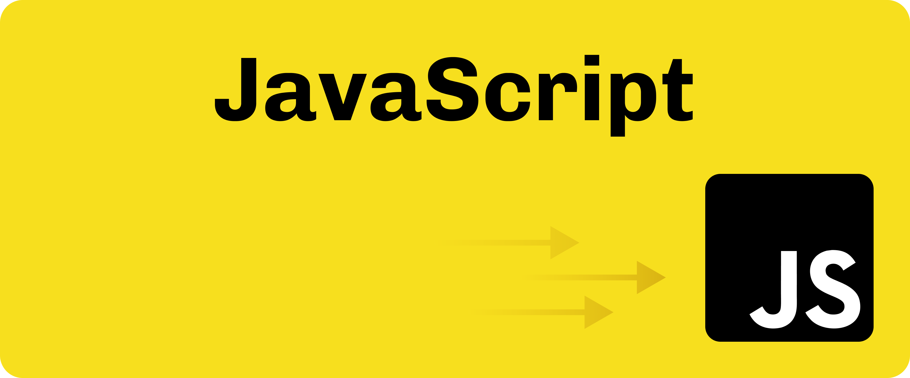

`by Kyojin Hwang`

<br/>

💡 원시 자료형

- 객체가 아니면서 method를 가지지 않는다.
- 원시 자료는 "하나" 의 정보(데이터)를 가지고 있다.

<br/>

💡 참조 자료형

- 참조형은 원시형의 데이터 집합이다.
- 배열, 객체, 함수가 대표적이다.
- 원시 자료형이 아닌 모든 것은 참조 자료형이다.

<br/>

## 📚카테고리 (Category)

- [String, Number](<#String,-Number(원시형)>)
- [Boolean, null, undefined](<#Boolean,-null,-undefined(원시형)>)
- [배열 (Array)](<#배열-Array-(참조형)>)
- [객체 (Object)](<#객체-Object-(참조형)>)
- [함수 (Function)](#함수-Function)
- [참과 거짓 (Truthy-Falsy)](<#참과-거짓(Truthy-&-Falsy)>)

## String, Number(원시형)

```javascript {numberLines}
// String
const string1 = 'Hello' // 쌍따옴표
const string2 = 'Hello' // 따옴표
const string3 = `Hello ${string1} ?!` // 백틱을 이용한 (템플릿 리터럴) 방식
```

```javascript {numberLines}
// number
const number1 = 1
const number2 = NaN // Not of Number
const number3 = +'3' // + 를 string 에 붙이면 number type으로 변환된다 숫자만해당
const number3 = Number('4') // Number(들어갈 숫자)
```

[📚Move](<#📚카테고리-(Category)>)

<br />

## Boolean, null, undefined(원시형)

```javascript {numberLines}
// Boolean
const a = true
const b = false

if (a) {
  console.log('Hello')
}
if (b) {
  console.log('Hello')
}
// a 는 true 이므로 실행된다
// b 는 flase 이므로 실행되지않는다
```

```javascript {numberLines}
// Null, undefined
// null : 존재 하지않것나 , 알수없거나 , 비어있다. ( 명시적으로 값 x )
// undefined : 값이 없는 상태 ( 암시적으로 값 x )
let age = null
let age2 = undefined // === let age2  같은것
console.log(age)
// null 출력

setTimeout(function () {
  age = 27
  console.log(age)
  // 27
  console.log(age2)
  // 27
}, 1000)

const user = {
  name: 'Kyojin',
  age: 27
}

console.log(user.name)
// kyojin
console.log(user.age)
// 27
console.log(user.email)
// undefined
```

[📚Move](<#📚카테고리-(Category)>)

<br />

## 배열 Array (참조형)

```javascript {numberLines}
// 배열 만드는법
//  1-1. new라는 키워드 함께 생성자 함수 or Javascript Class
const fruits = new Array('Apple', 'Banana', 'Cherry')
//  1-2. (기호를 이용한 리터럴 방식) [] 대괄호를 씌운다
const fruits = ['Apple', 'Banana', 'Cherry']

// Apple Banana 등 Array 안에 있는 요소를 Element 라고 한다.

console.log(fruits)
// ['Apple','Banana', 'Cherry']

console.log(fruits[0]) // 대괄호표기법 ( 인덱싱 : 숫자로 조회하는것 )
// Banana
```

[📚Move](<#📚카테고리-(Category)>)

<br />

## 객체 Object (참조형)

```javascript {numberLines}
// 생성자 함수로 만드는 방식
const user = new Object()
user.name = 'Kyojin'
user.age = 27

console.log(user)
// {
//  name:'kyojin',
//  age:'27',
// }
```

```javascript {numberLines}
// 함수 내부에서 this 라는 키워드로 만드는 방식
function User() {
  this.name = 'kyojin'
  this.age = 27
}

const user = new User()

console.log(user)
// User라는 함수를 통해 만들어진 객체 여서 앞에 User가 붙는다.
// User {
// name:'kyojin',
// age:'27'
// }
```

```javascript {numberLines}
// 기호를 이용하여 만드는 리터럴 방식
const user = {
  name: 'kyojin',
  age: 27
}
console.log(user)
// {
//  name:'kyojin',
//  age:'27',
// }
```

[📚Move](<#📚카테고리-(Category)>)

<br />

## 객체 Object 사용법

```javascript {numberLines}
// 객체 표기법
const user = {
  name: "kyojin",
  age: 27,
};

const key = "name";

// 1. 점 표기법 : 변수를 채워넣을수 없다.
console.log(user.name);
// kyojin

// 2. 대괄호 표기법 : 변수를 채워넣을수 있다.
console.log(user["name"]);
// kyojin
console.log(user[key]);
// kyojin

--------------------------------

const userA = {
  name: "kyo",
  age: 27,
};
const userB = {
  name: "min",
  age: 29,
  parent: userA,
};

console.log(userB.parent.name);
// kyo

console.log(userB["parent"]["name"]);
console.log(userB["parent"].name);
// kyo
```

[📚Move](<#📚카테고리-(Category)>)

<br />

## 함수 Function

```javascript {numberLines}
// function 함수이름 () {
//  함수 기능
// }
-------------------------------------------------
function hello () {
  console.log('Hello!')
}
hello()  //  <-- 함수 호출 ( 함수 실행한다는 것 )

-------------------------------------------------
function getNumber() {
  return 123
}
console.log(getNumber())
// 123

// b는 매개변수라고 하며 값을 넣어줄 수 있다.
const a = function(b) {
  consol.log(b)
}

a('hi')
// hi 출력
```

[📚Move](<#📚카테고리-(Category)>)

<br />

## 참과 거짓(Truthy & Falsy)

```javascript {numberLines}
// 참과 거짓(Truthy & Falsy)

// 참에 해당하지 않는 것
// 1) false
// 2) 0
// 3) null
// 4) undefined
// 5) NaN
// 6) ''
// 7) 0n (bigint)

// ex1) 배열에 데이터가 있을 때
const fruits = ['Apple', 'Banana']

if (fruits) {
  console.log('아이템이 들어있음!')
}
// 아이템이 들어있음!
// fruits 는 배열에 데이터가 있으므로 True

// ex2) 배열에 데이터가 없을 때
const fruits = []

if (fruits.length) {
  console.log('아이템이 들어있음!')
}
// 아무것도 뜨지않음 이유는 fruits 배열의 length 0
// 즉 배열의 길이는 0 이기 때문에 아무것도 없어서.
```

[📚Move](<#📚카테고리-(Category)>)

<br />
