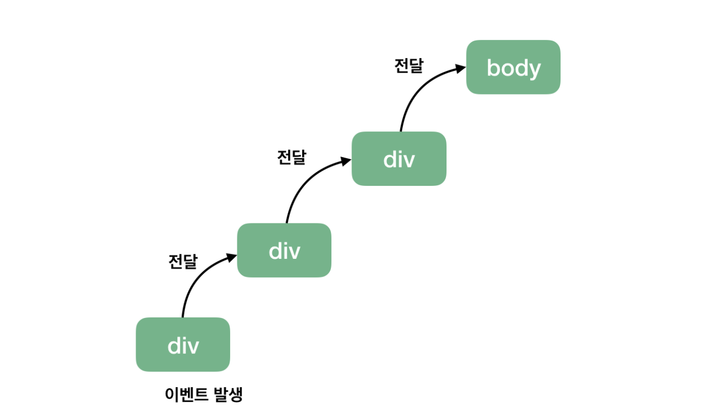
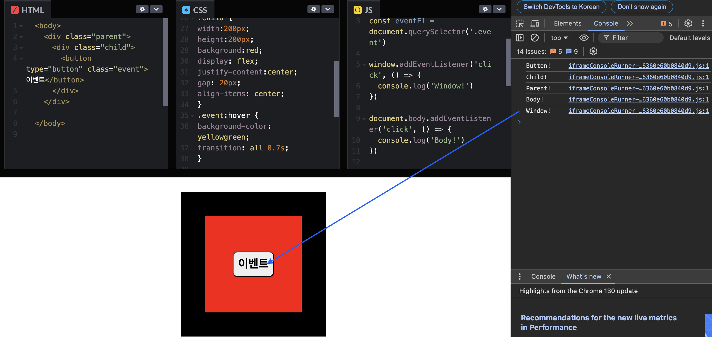
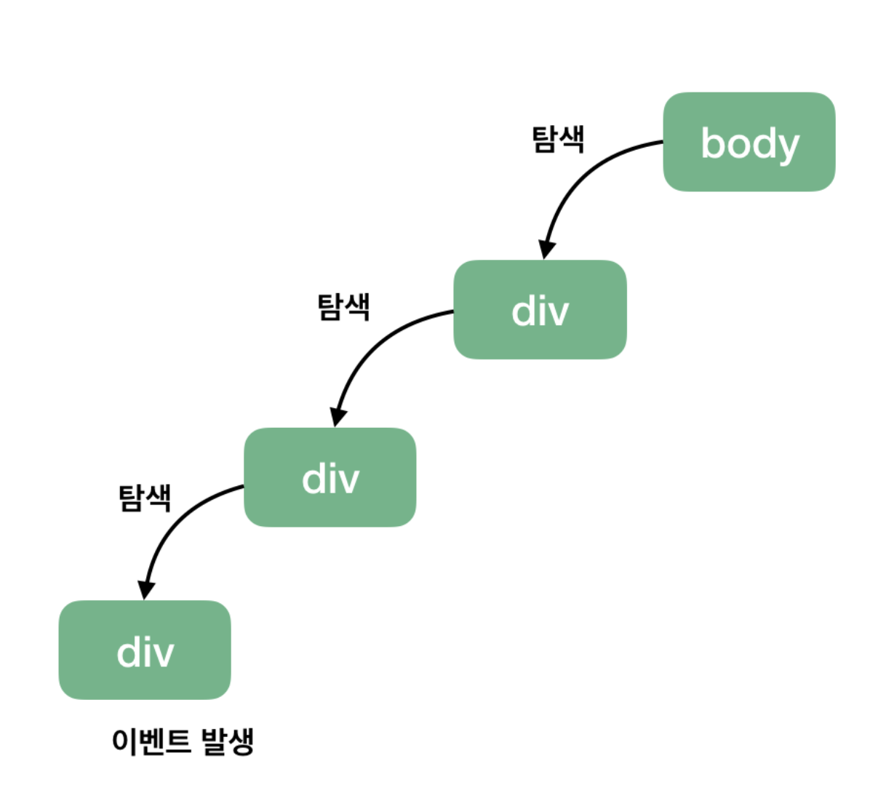
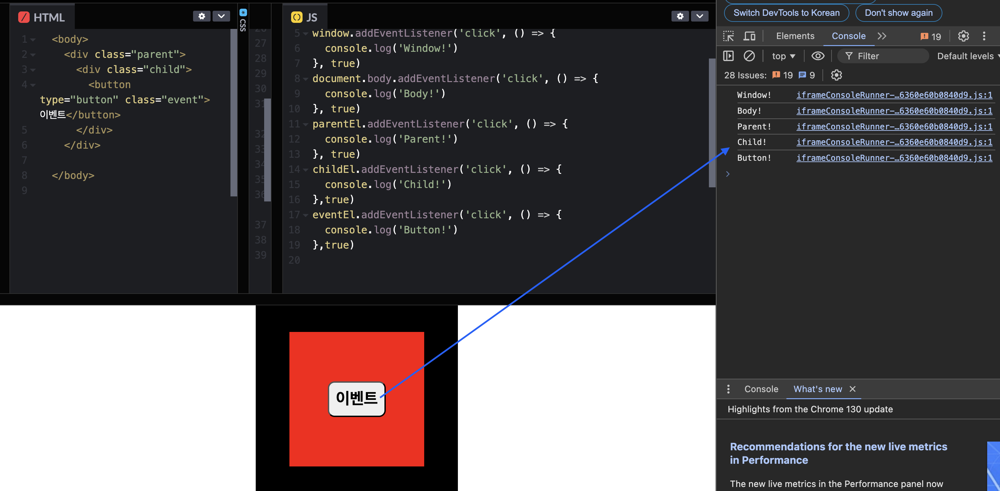

`by Kyojin Hwang`

<br/>

## 📚카테고리 (Category)

- [📌 이벤트 추가 및 제거](#📌-이벤트-추가-및-제거)
- [📌 기본동작방지 및 버블링 캡처링](#📌-기본동작방지-및-버블링-캡처링)
- [📌 이벤트 위임](#📌-이벤트-위임)

## 📌 이벤트 추가 및 제거

- addEventListener()

  - 대상에 이벤트를 등록한다.
  - 대상에 지정한 이벤트가 발생됐을 때 지정한 함수(Handler)가 호출된다.

- removeEventListener()

  - 대상에 등록했던 이벤트를 제거한다.
  - 메모리 관리를 용이하기 위해서 사용되기도 한다.

`사용 예시`

<iframe height="300" style="width: 100%;" scrolling="no" title="Untitled" src="https://codepen.io/owencold/embed/PoMaoBv?default-tab=html%2Cresult&editable=true" frameborder="no" loading="lazy" allowtransparency="true" allowfullscreen="true">
  See the Pen <a href="https://codepen.io/owencold/pen/PoMaoBv">
  Untitled</a> by Owen (<a href="https햣://codepen.io/owencold">@owencold</a>)
  on <a href="https://codepen.io">CodePen</a>.
</iframe>

[📚Move](<#📚카테고리-(Category)>)

## 📌 기본동작방지 및 버블링 캡처링

### 기본동작방지

- event.preventDefault()

  - 해당 이벤트에 대한 사용자의 기본 동작을 실행하지 않도록 지정한다.

### 버블링

- 특정 화면 요소에서 이벤트가 발생했을 때, 해당 이벤트가 더 상위의 화면 요소들로 전달되어가는 특성을 의미한다.





<center>클릭시 console</center>

### 캡처링

- 이벤트 버블링과 반대 개념, 특정 화면 요소에서 이벤트가 발생했을 때 브라우저로부터 이벤트가 발생한 요소까지 이벤트를 전달하는 특성




<center>클릭시 console</center>

### 캡처링 및 버블링 막는방법

- event.stopPropagation()
  - 버블링 및 캡처링을 막을때 사용하는 메소드

[📚Move](<#📚카테고리-(Category)>)

## 📌 이벤트 위임

- 비슷한 패턴의 여러 요소에서 이벤트를 핸들링해야 하는 경우
- 단일 조상 요소에서 제어해야 하는 이벤트 위임 패턴 사용할 수 있다.

```html {numberLines}
<div class="parent">
  <div class="child">내용 1</div>
  <div class="child">내용 2</div>
  <div class="child">내용 3</div>
</div>
```

```javascript {numberLines}
const parentEl = document.querySelector('.parent')
const childEls = document.querySelectorAll('.child')

// 각 대상요소에 클릭
childEls.forEach((el) => {
  el.addEventListener('click', (event) => {
    console.log(event.target.textContent)
  })
})

// 조상위임 패턴
parentEl.addEventListener('click', (event) => {
  console.log(event)
  const childEl = event.target.closest('.child')
  if (childEl) console.log(childEl.textContent)
})
```

[📚Move](<#📚카테고리-(Category)>)
