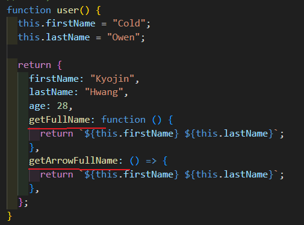
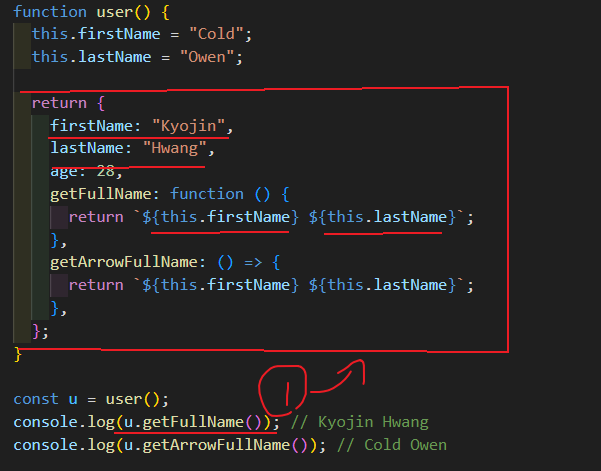
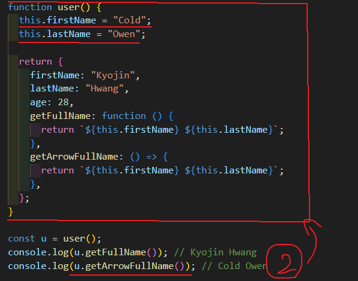

`by Kyojin Hwang`

<br/>

## 📚카테고리 (Category)

1. [선언과 표현](#📌-선언과-표현)
1. [호이스팅](#📌-호이스팅)
1. [반환 및 종료](#📌-반환-및-종료)
1. [매개변수 패턴](<#📌-매개변수-패턴-(Parameter-pattern)>)
1. [화살표 함수](<#📌-화살표-함수-(Arrow-function)>)
1. [즉시실행함수](<#📌-즉시실행함수-(IIFE,-Immediately-Invoked-Function-Expression)>)
1. [콜백](<#📌-콜백(Callback)>)
1. [재귀](<#📌-재귀(Recursive)>)
1. [호출 스케줄링](#📌-호출-스케줄링)
1. [this](#📌-this)

## 📌 선언과 표현

```javascript {numberLines}
// 함수 선언문(Declaration)
function hello() {}

// 함수 표현식(Expression)
const hello = function () {}

// 호출방법 : 함수이름을 적고 소괄호로 호출하여 실행한다.
hello()
```

**😫선언식과 표현식의 차이점**

`선언식` : 함수 전체를 호이스팅 한다. 정의된 범위의 맨 위로 호이스팅되서 함수 선언
전에 함수를 사용할 수 있다는 것이다.

`표현식` : 별도의 변수에 할당하고, 변수는 선언부와 할당부를 나누어 호이스팅한다.

<br/>

**함수선언식 과 함수 표현식**

```javascript {numberLines}
// 호이스팅
// 함수 선언식
alert(bomb()) // ❌에러 발생 bomb 함수는 아직 로드안됨
const bomb = function () {
  return 1
}

// 함수 표현식
alert(bomb())
// 선언 전에 호출되도 정상 동작⭕
function bomb() {
  return 5
}
```

**🙄그럼 누가 더 좋아?**

<br/>

**함수 표현식의 장점**

`내생각` : 아무래도 함수표현식이 더좋다!
그이유는 코드가 너무 깔끔하게 보이는게 나에게는 아직은 가장 큰 장점인것 같다...

> **클로저**
>
> 함수가 종료돼도, 렉시컬 스코프의 index와 같은 정보를 유지한다.

> **인자 전달**
>
> 함수 표현식은 중간 임시 변수에 할당 할 필요없이 함수에 직접 전달할 수 있다.

> **IIFE (즉시 주입 함수 표현식)**
>
> 함수와 변수가 전역 스코프에 영향을 미치지 않도록 방지하는 데 사용된다.

[📚Move](<#📚카테고리-(Category)>)
<br/>
<br/>

## 📌 호이스팅

**👊호이스팅이란?**

코드가 실행하기전 `변수선언` / `함수선언`이 해당 스코프의 최상단으로
<br/>
끌어 올려진것 같은 현상을 말한다.

<br/>

**📃변수 호이스팅**

- 모든 선언에는 호이스팅이 일어난다.
- 하지만 let, const, class를 이용한 선언물을 호이스팅이 발생하지 않는것 처럼 동작

<br/>

**자바스크립트에서의 변수 처리**

자바스크립트에서는 총 3단계에 걸쳐 변수를 생성한다.

1. 선언 단계(Declaration phase)

   - 변수 객체(Variable Object)를 생성하고 변수를 등록한다.
   - 스코프는 해당 변수 객체를 참조한다.

2. 초기화 단계(Initialization phase)

   - 변수 객체(Variable Object)에 등록된 변수를 메모리에 할당한다.
   - 변수는 undefined로 초기화된다.

3. 할당 단계(Assignment phase)
   - undefined로 초기화된 변수에 실제값을 할당한다.

<br/>

**❗호이스팅 예시**

```javascript {numberLines}
// 호이스팅 때문에 선언이 끌어올려져서 오류 안남⭕
console.log(text); // (선언 + 초기화 된 상태)
text = 'kyo!'; // (선언 + 초기화 + 할당 된 상태)
var text;
console.log(text);
----------------------------------------------------
text = 'Hello'; // 선언 없으면 var로 선언한 것과 동일해진다.❌
let text; // 여기서 var 선언을 let으로 변경해준 것이다.❌
console.log(text);
// let 키워드로는 선언이 끌어올려지지 않기 때문에 undefined를 리턴함.
----------------------------------------------------
const text;
// 에러남. 주의❗ 애초에 const 키워드로 재할당 불가능! 그래서 선언과 동시에 할당해야함
----------------------------------------------------
```

`참고 블로그`

https://hanamon.kr/javascript-%ED%98%B8%EC%9D%B4%EC%8A%A4%ED%8C%85%EC%9D%B4%EB%9E%80-hoisting/

https://yoo11052.tistory.com/151

<br/>

[📚Move](<#📚카테고리-(Category)>)
<br/>

## 📌 반환 및 종료

**return**

- 함수 내부에서 정해진 명령들을 실행후 다시 돌려준다,반환한다 라는 의미다.
- 함수 중단할 때 쓰인다.

```javascript {numberLines}
function hello() {
  return "Hello~";
}
console.log(hello()); // Hello~

function hello2() {
  return;
}
console.log(hello2()); // undefined

-------------------------------------
// 예시
function plus(num){
   return num + 1;
}
console.log(plus(2)); // 3
console.log(plus(7)); // 8
console.log(plus()); // NaN : 이유는 num에 아무값도 들어오지않아서 (undefined + 1)

// 하지만 NaN 이 안나오는 방법이 있다❗
function plus(num){
   // 조건문을 활용한다.
   if(typeof num !== 'number'){
      console.log('숫자를 입력해주세요.')
      return 0; // 여기서 return을 사용하였기 때문에 아래의 return은 사용되지 않는다.
   }
   return num + 1;
}
```

[📚Move](<#📚카테고리-(Category)>)
<br/>

## 📌 매개변수 패턴 (Parameter pattern)

**매개변수**

- 함수에 전달되는 값을 담는 변수를 말한다.

**인자**

- 함수를 호출할 때 실제로 전달되는 값

```javascript {numberLines}
// function add(a,b) => a와 b는 매개변수 이다.
function add(a, b) {
  return a + b;
}

// add(5, 3) => 5와 3은 인자
console.log(add(5, 3)); // 8

----------------------------------------------

// 🧐기본값 패턴
// b 에 기본 값 1을 주고
// 값을 넣어도되고 안넣어줘도 기본값을 사용할 수 있게 만들어줬다.
function sum(a, b = 1){
   return a + b;
}
console.log(sum(7)); // 8
console.log(sum(1,2)); // 3

----------------------------------------------

// 🧐객체 구조분해할당 패턴
const userObj = {
   name : 'kyo',
   age : 28
   email: 'owen1127@naver.com'
}

// ex)1 : user 파라미터를 구조분해할당하여 변수에 저장하여 사용
function getName(user){
   const { name } = user // 여기는 파라미터를 가지고온다.
   return name;
}

// ex)2 : 파라미터에서 구조분해할당하여 코드를 줄인다.
function getName({name}){
   return name;
}

// ex)3 : 기본값을 활용한 구조분해할당 패턴
function getEmail({ email = '이메일이 없습니다.'}) {
   return email;
}


// 여기는 맨상단 객체를가져와서 인자로 넣는다
console.log(getName(userObj)); // kyo
console.log(getEmail(userObj)); // owen1127@naver.com

----------------------------------------------

// 🧐배열 구조분해할당 패턴
const fruits = ['Apple', 'Banana', 'Cherry']

// ex1 ) 첫번째 방법
function getFruits([a, b, c]){
   return b;
}

// ex2 ) 두번째 방법
function getFruits([, b]){
   return b;
}

console.log(getFruits); // Banana

----------------------------------------------

// 🧐나머지 매개변수(Rest parameter)
// 매개변수 몇개를 사용할지 모를때 사용하게 된다.

function sum(...rest) {
   console.log(rest);

   console.log(arguments);
   // arguments(유사배열)는 배열데이터가 아니여서 reduce 사용불가
   return rest.reduce(function (acc, cur) {
      return acc + cur;
   }, 0);
}
console.log(sum(1, 2)); // 3
console.log(sum(1, 2, 3, 4)); // 10
console.log(sum(1, 2, 3, 4, 5, 6, 7, 8, 9, 10)); // 55

```

[📚Move](<#📚카테고리-(Category)>)
<br/>

## 📌 화살표 함수 (Arrow function)

- 화살표 함수는 항상 어떤 변수에다가 할당을해서 사용한다.
- 코드가 깔끔해보인다.
- 자신만의 this를 가질수 없다.
  <br />

```javascript {numberLines}
const sum = (a, b) => {
  return a + b
}
console.log(sum(1, 2)) // 3
```

**화살표 함수의 패턴**

```javascript {numberLines}
const a = () => {}
const b = (x) => {}
const c = (x, y) => {}
const d = (x) => {
  return x * x
}
const e = (x) => x * x
const f = (x) => {
  console.log(x * x)
  return x * x
}
const g = () => {
  return { a: 1 }
}
const h = () => ({ a: 1 })
const i = () => {
  return [1, 2, 3]
}
const j = () => [1, 2, 3]
```

[📚Move](<#📚카테고리-(Category)>)
<br/>

## 📌 즉시실행함수 (IIFE, Immediately-Invoked Function Expression)

```javascript {numberLines}
// 기존함수 사용방법
const a = 7

const double = () => {
  console.log(a * 2)
}

double() // 14

// 즉시실행함수
const a = 7

;(() => {
  console.log(a * 2)
})()

// 즉시실햄함수 패턴
;(() => {})() // 첫번째
;(function () {})() // 두번째

// 즉시실행함수 사용해보기
;((a, b) => {
  console.log(a)
  console.log(b)
})(1, 2)
```

[📚Move](<#📚카테고리-(Category)>)
<br/>

## 📌 콜백(Callback)

- 함수가 실행될 때 인수로 들어가는 또 하나의 함수이다.

```javascript {numberLines}
// ex1)
const a = (callback) => {
  callback()
  console.log('A')
}

const b = () => {
  console.log('B')
}

a(b) // B다음 A 가 나온다.

// ex2)
const sum = (a, b, c) => {
  // setTimeout : 지연시켜주는 함수 (현재 여기서는 콜백으로 사용된다.)
  setTimeout(() => {
    // c 는 sum의 세번째 매개변수의 함수를 실행시킨다.✔
    c(a + b)
  }, 1000)
}

sum(1, 2, (value) => {
  console.log(value) // 3
})
sum(3, 5, (value) => {
  console.log(value) // 8
})
```

[📚Move](<#📚카테고리-(Category)>)
<br/>

## 📌 재귀(Recursive)

- 하나의 함수에서 그 함수 자기 자신을 다시 내부에서 호출하는 방식

```javascript {numberLines}
// 조건을 주지않으면 무한반복된다 그리고 컴퓨터가 터진다.💣
let i = 0
const a = () => {
  console.log('A')
  i += 1
  if (i < 4) {
    a()
  }
}

a()

// 객체로 재귀예시 만들어보기
const userA = { name: 'A', parent: null }
const userB = { name: 'B', parent: userA }
const userC = { name: 'C', parent: userB }
const userD = { name: 'D', parent: userC }

const getRootUser = (user) => {
  if (user.parent) {
    // userB,C,D 는 parent가 이어져서 다시 함수를 호출한다.
    return getRootUser(user.parent)
  }
  // 마지막으로 A에는 null 이기때문에 A객체가 나오게 된다.
  return user
}
console.log(getRootUser(userD))
```

[📚Move](<#📚카테고리-(Category)>)
<br/>

## 📌 호출 스케줄링

`스케줄링이란?🧐`

- 자원을 효율적으로 사용하기 위해 자원을 사용하는 순서를 결정짓는 작업이다. ( 복잡한 순서없이 깔끔하게 할일을 정리해서 하는 작업이다.)

```javascript {numberLines}
const hello = () => {
  console.log('Hello')
}

// 스케줄
const timeout = setTimeout(hello, 2000)
// ex1) 곧바로 종료
// clearTimeout 으로 인하여 timeout이 실행되지 않는다.
clearTimeout(timeout)

// ex2) h1 클릭으로 인해 종료
const h1El = document.querySelector('h1')
h1El.addEventListener('click', () => {
  console.log('Clear!')
  clearTimeout(timeout)
})
```

**setTimeout과 setInterval 차이**

- setTimeout은 delay에 있는 시간 이후 한번만 실행한다.
  - 종료는 clearTimeout 이다.
- setInterval은 delay에 있는 시간마다 계속 실행한다.
  - 종료는 clearInterval 이다.

<br/>

[📚Move](<#📚카테고리-(Category)>)
<br/>

## 📌 this

- 자신이 속한 `객체` 또는 자신이 생성할 `인스턴스` 를 가리키는 자기 참조 변수
- 일반 함수의 this는 호출 위치에서의 정의
- 화살표 함수의 this는 자신이 선언된 함수(렉시컬) 범위에서 정의
- `렉시컬이란?🧐` 함수가 동작할 수 있는 유효한 범위!!

```javascript {numberLines}

// ex 1)
const user = {
  firstName: "Kyojin",
  lastName: "Hwang",
  age: 28,
  // 일반함수 접근
  getFullName: function () {
    // user 안에서 사용하기 때문에 단순하게 this로 접근이 가능하다
    return `${this.firstName} ${this.lastName}`;
  },

  // 화살표함수 접근
  getArrowFullName:  () => {
    return `${this.firstName} ${this.lastName}`;
  },
};

console.log(user.getFullName()); // Kyojin Hwang
console.log(user.getArrowFullName()); // undefined undefined

----------------------------------------------

// ex 2)
function user() {
  this.firstName = "Cold";
  this.lastName = "Owen";

  return {
    firstName: "Kyojin",
    lastName: "Hwang",
    age: 28,
    getFullName: function () {
      return `${this.firstName} ${this.lastName}`;
    },
    getArrowFullName: () => {
      return `${this.firstName} ${this.lastName}`;
    },
  };
}

const friend = {
  firstName: "Yonam",
  lastName: "Youtube",
};

const u = user();
console.log(u.getFullName()); // Kyojin Hwang
console.log(u.getArrowFullName()); // Cold Owen
console.log(u.getFullName.call(friend)); // Yonam Youtube

----------------------------------------------

// ex 3) 렉시컬 예제 만들기
const timer = {
  title: "TIMER!",
  timeout() {
    console.log(this.title);

    // 아래의 setTimeout에서 일반함수를 사용하면 안되는이유❗
    // setTimeout의 내부구조를 알 수 없기 때문에 undefined 가 나오게된다.
    // 그래서 setTimeout을 화살표함수로 표기할 경우 timeout의 this를 바라본다.
    setTimeout(() => {
      // 콜백
      console.log(this.title);
    }, 1000);
  },
};

timer.timeout(); // TIMER! (1초뒤) TIMER!


```

> **Property**
>
> - 객체의 내부의 속성이다.
>
> - 객체 내부에 함수를 값으로 가지는 속성은 `메서드(Method)`라고 할 수 있습니다.

> **`Method란?🧐`**
>
> `getFullName` 과 `getArrowFullName` 같이 객체에 할당되는 함수



<br/>

> **this 일반함수 접근 ( 상단의 예제로 설명)**



<br/>

> **this 화살표함수 접근 ( 상단의 예제로 설명)**



<br/>

[📚Move](<#📚카테고리-(Category)>)
