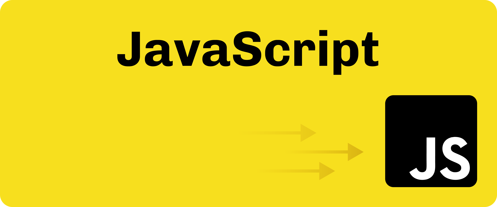

`by Kyojin Hwang`

<br/>
<br/>

## 📌 스코프 (Scope)

- 코드가 영향을 미치는 범위, 변수의 유효 범위
- 계층적인 구조를 가지기 때문에 하위 스코프는 상위 스코프에 접근할 수 있지만, 상위 스코프는 하위 스코프에 접근할 수 없다.

<br/>

### 🚀 스코프 동작 구분

- Lexcial Scope(= Static Scope) 란?

  - 렉시컬 스코프, 또는 정적(static) 스코프는 프로그래밍 언어에서 변수의 유효 범위(scope)를 결정하는 규칙 중 하나이다.
  - 함수 호출 시점과는 무관하게 변수 선언 위치에 따라 스코프가 결정되는 것을 말한다.

- Dynamic Scope (동적스코프) 란?
  - 함수가 호출된 위치에 따라 변수의 유효 범위가 결정됩니다.
  - 동적 스코프에서는 함수 호출 시점에 따라 변수를 찾습니다.

`정적스코프 예시`

```javascript {numberLines}
var name = 'Global Name'

function outer() {
  var name = 'Outer Name' // 'Outer Name' 변수는 outer 함수 스코프에 속함

  function inner() {
    // inner 함수는 outer 함수 안에 정의되어 있으므로 outer 함수의 변수 name을 참조
    console.log(name)
  }
  inner() // 'Outer Name' 출력
}

outer()
```

`동적스코프 에시`

```javascript {numberLines}
var name = 'Global Name'

function outer() {
  var name = 'Outer Name' // outer 스코프에서 선언된 name
  inner() // inner 함수 호출 시점에 스코프를 참조
}

function inner() {
  console.log(name) // inner 함수는 호출된 시점의 스코프에서 'Global Name'을 참조
}

outer() // 'Global Name' 출력
```

#### `스코프 동작구분 결론`

| **특성**              | **렉시컬 스코프 (Lexical Scope)**              | **동적 스코프 (Dynamic Scope)**                |
| --------------------- | ---------------------------------------------- | ---------------------------------------------- |
| **스코프 결정 시점**  | 함수가 **정의된 위치**에 따라 결정             | 함수가 **호출된 위치**에 따라 결정             |
| **변수 검색**         | 함수가 정의된 위치에서 스코프 체인을 따라 검색 | 함수 호출 시점의 스코프에서 변수를 검색        |
| **변수의 유효 범위**  | 함수가 정의된 스코프 내에서만 유효             | 함수 호출 시점의 스코프에서 유효               |
| **자바스크립트 동작** | 자바스크립트는 **렉시컬 스코프**를 사용        | 자바스크립트는 **동적 스코프**를 사용하지 않음 |

<br/>

> 단, this 메커니즘이 동적 스코프와 비슷한 면이있다.

### 🚀 스코프 레벨 구분

### **전역스코프 (Global Scope)**

> - 전역 스코프는 전역으로 선언된 변수에 대해 접근과 조작이 가능한 유효한 범위를 의미한다.
> - 변수가 어떠한 함수에도 속하지 않은 상태
> - 어떠한 중괄호 안에 들어있지 않은 상태라면 그 변수를 전역 변수라 부른다.

`전역스코프 예시`

```javascript {numberLines}
let global = 'Global!' // 전역 변수

function scope() {
  let local = 'Local!' // 지역 변수
  console.log(global)
}

scope() // Global!
console.log(local) // local is not defined
```

### **지역스코프 (Local Scope)**

> - 함수 혹은 블록 내에서 접근(호출)이 가능한 유효한 범위를 의미
> - 지역스코프에는 `Function Scope` 또는 `Block Scope` 존재한다.

#### 함수 레벨 스코프(Function Scope)

- 함수 스코프는 함수에서 선언한 변수는 해당 함수 내에서만 접근 가능하다.
- var로 선언된 변수, 함수들은 함수 레벨 스코프가 된다.

`함수스코프 예시`

```javascript {numberLines}
function varTest() {
  var a = '1' // 함수 내부에서 선언
}
console.log(a) // Uncaught ReferenceError: a is not defined
```

`var 중괄호 에시`

```javascript {numberLines}
if (true) {
  var a = '123' // var로 선언하면 블록(중괄호)에 의한 범위 제한이 없음
}
console.log(a) // 123
```

#### 블록 레벨 스코프(Block Scope)

- 블록 스코프는 선언한 변수가 블록(중괄호 내)에서 유효한 범위를 의미한다.
- let, const 로 선언된 변수

`let,const 중괄호 예시`

```javascript {numberLines}
if (true) {
  const a = '123' // const, let은 블록 스코프를 따름
}
console.log(a) // ReferenceError: a is not defined
```

`var와 let,const 차이`

```javascript {numberLines}
function hello() {
  for (var i=0; i<12; i++) {
    ...
  }
  console.log(i)   //접근가능
}

hello();  //12
```

```javascript {numberLines}
function hello() {
  for (let i=0; i<12; i++) {
    ...
  }
  console.log(i)
}

hello();  //ReferenceError: i is not defined
```

## 📌 스코프체인 (Scope Chain)

- 현재 스코프 레벨에서 참조값이 없는 경우 상위 레벨의 스코프에서 참조값을 찾아 나가는 현상

`스코프체인 예시`

```javascript {numberLines}
var globalVar = '전역 변수' // 전역 변수

function outerFunction() {
  var outerVar = '외부 함수 변수' // 외부 함수 변수

  function innerFunction() {
    var innerVar = '내부 함수 변수' // 내부 함수 변수
    console.log(innerVar) // 내부 함수에서 "내부 함수 변수" 출력
    console.log(outerVar) // 외부 함수에서 "외부 함수 변수" 출력
    console.log(globalVar) // 전역에서 "전역 변수" 출력
  }

  innerFunction() // innerFunction을 호출
}

outerFunction() // outerFunction을 호출
```

#### 스코프체인 결론

- 현재 함수에서 변수를 찾을 수 없다면, 그 함수가 선언된 외부 함수에서 변수를 찾고, 그 외부 함수에서도 찾을 수 없다면, 전역 함수(가장 바깥쪽)에서 변수를 찾는 방식입니다.
