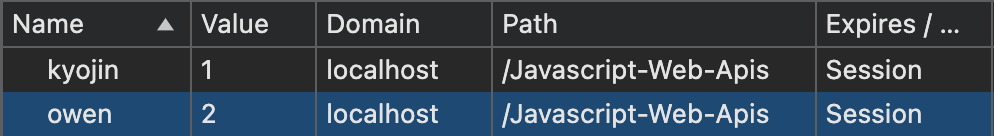
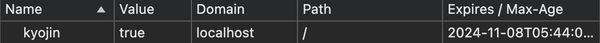
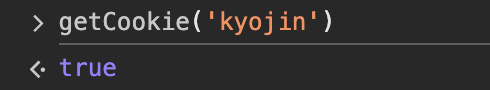
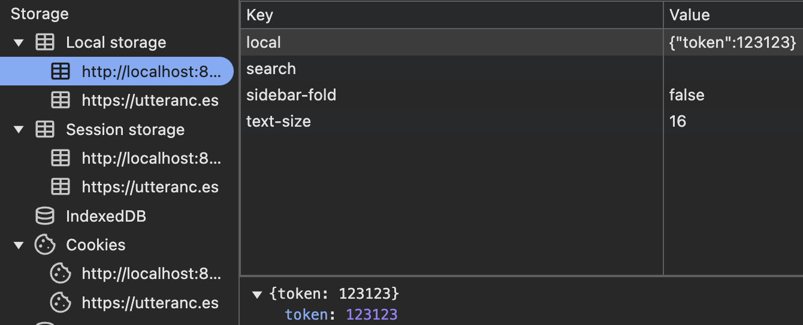
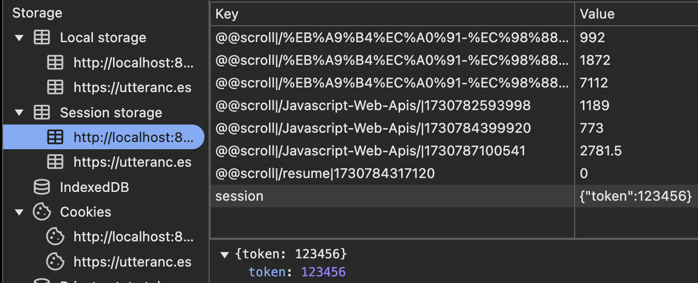
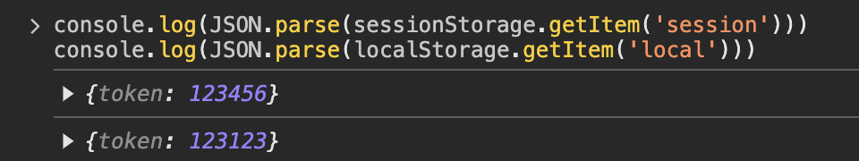
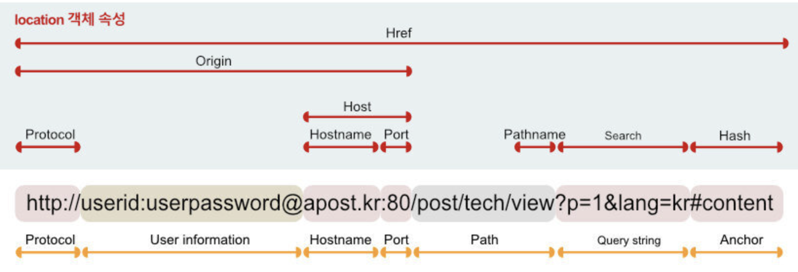

`by Kyojin Hwang`

## 📚카테고리 (Category)

- [📌 Cookie Storage](#📌-Cookie-Storage)
- [📌 Location](#📌-Location)
- [📌 History](#📌-History)

## 📌 Cookie Storage

### Cookie 란?

- 도메인 단위로 저장
- 표준안 기준, 사이트당 최대 20개 및 4KB로 제한
- 영구 저장 불가능

### Cookie Properties

- domain : 유효한 도메인을 설정한다.
  - https://www.bobcost.kr
- path : 유효한 경로를 설정한다.
  - https://www.bobcost.kr/resume
  - resume 은 패스가 된다.
- expires : 만료날짜(UTC Date) 설정
- max-age : 만료 타이머(s) 설정

`쿠키 저장`

```javascript {numberLines}
document.cookie = 'kyojin=1'
document.cookie = 'owen=2'
```



<center>쿠키저장 예시</center>

`함수만들어서 쿠키 저장`

```javascript {numberLines}
const setCookie = (name, value, exp, path = '/') => {
  let date = new Date()
  // getTime : 현재 시간을 밀리초(1/1000초)로 얻는다.
  date.setTime(date.getTime() + exp * 24 * 60 * 60 * 1000)

  // 객체나 배열이 전달될 경우 JSON.stringify로 변환
  const cookieValue = typeof value === 'object' ? JSON.stringify(value) : value

  document.cookie = `${name}=${cookieValue}; expires=${date.toUTCString()}; path=${path};`
}

setCookie('kyojin', true, 3)
```



<center>함수만들어 저장 예시</center>

`쿠키 불러오기`

```javascript {numberLines}
const getCookie = (name) => {
  const cookie = document.cookie.split('; ').find((item) => item.split('=')[0] === name)
  if (!cookie) return null // 해당 쿠키가 없으면 null 반환

  const value = cookie.split('=')[1]

  // JSON 문자열인 경우 파싱, 그렇지 않으면 원래 값 반환
  try {
    return JSON.parse(value)
  } catch (e) {
    return value
  }
}

getCookie('kyojin')
```



<center>쿠키불러오기 예시</center>

`쿠키 삭제`

```javascript {numberLines}
const deleteCookie = (name, path = '/') => {
  document.cookie = `${name}=; expires=Thu, 01 Jan 1970 00:00:00 GMT; path=${path};`
}

deleteCookie('kyojin')
```

### Storage 란?

- 도메인 단위로 저장
- 5MB 제한
- 영구 저장이 가능하다. (session은 제외)

### Session, Local

- sessionStorage : 브라우저 탭이 유지되는동안 저장된다. 탭을 닫을 때 만료
- localStorage : 따로 제거하지 않으면 영구 저장된다.

### Storage Method

- setItem() : 데이터 추가
- getItem() : 데이터 조회
- removeItem() : 데이터 제거
- clear() : 스토리지 초기화

`저장 예시`

```javascript {numberLines}
sessionStorage.setItem('session', JSON.stringify({ token: 123456 }))
localStorage.setItem('local', JSON.stringify({ token: 123123 }))
```



<center>local 저장 예시</center>



<center>session 저장 예시</center>

`조회 예시`

```javascript {numberLines}
console.log(JSON.parse(sessionStorage.getItem('session')))
console.log(JSON.parse(localStorage.getItem('local')))
```



<center>Storage 조회 예시</center>

`삭제 예시`

```javascript {numberLines}
sessionStorage.removeItem('session')
localStorage.removeItem('local')
```

[📚Move](<#📚카테고리-(Category)>)

## 📌 Location

### Location?

- 현재 페이지의 정보를 반환하거나 제어한다.

### Location Properties

- href : 전체 URL 주소
- protocol : 프로토콜
- hostname : 도메인이름
- pathname : 도메인 이후 경로
- host : 포트 번호를 포함한 도메인 이름
- port : 포트 번호
- hash : 해시정보(anchor값 반환)
- search : URL에 붙은 매개변수(물음표 뒤의 값)



<center>Properties 설명</center>

### Locaion Method

- assign() : 지정된 URL로 페이지를 이동하며 히스토리에 추가한다..
- replace(): 현재 페이지를 지정된 URL로 대체합니다. 브라우저의 히스토리에 추가하지 않는다.
- reload(): 현재 문서를 새로 고칩니다. true를 인수로 전달하면 서버에서 새로 고침을 수행합니다.
  - reload(true) 경우 강력새로고침

[📚Move](<#📚카테고리-(Category)>)

## 📌 History

### History Properties

| 속성     | 설명                                                                                   |
| -------- | -------------------------------------------------------------------------------------- |
| `length` | 브라우저 세션의 히스토리 항목 수를 반환합니다.                                         |
| `state`  | 현재 세션의 상태 객체를 반환합니다. (마지막 pushState 또는 replaceState에 의해 설정됨) |

### History Method

| 메서드                            | 설명                                                   |
| --------------------------------- | ------------------------------------------------------ |
| `back()`                          | 이전 페이지로 이동합니다.                              |
| `forward()`                       | 다음 페이지로 이동합니다.                              |
| `go(delta)`                       | 지정된 페이지로 이동합니다. (양수: 앞으로, 음수: 뒤로) |
| `pushState(state, title, url)`    | 브라우저의 히스토리 스택에 새로운 상태를 추가합니다.   |
| `replaceState(state, title, url)` | 현재 상태를 새로운 상태로 대체합니다.                  |

<br/>

[📚Move](<#📚카테고리-(Category)>)
