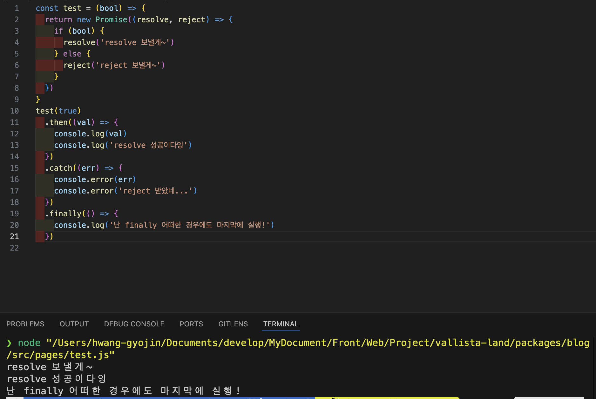
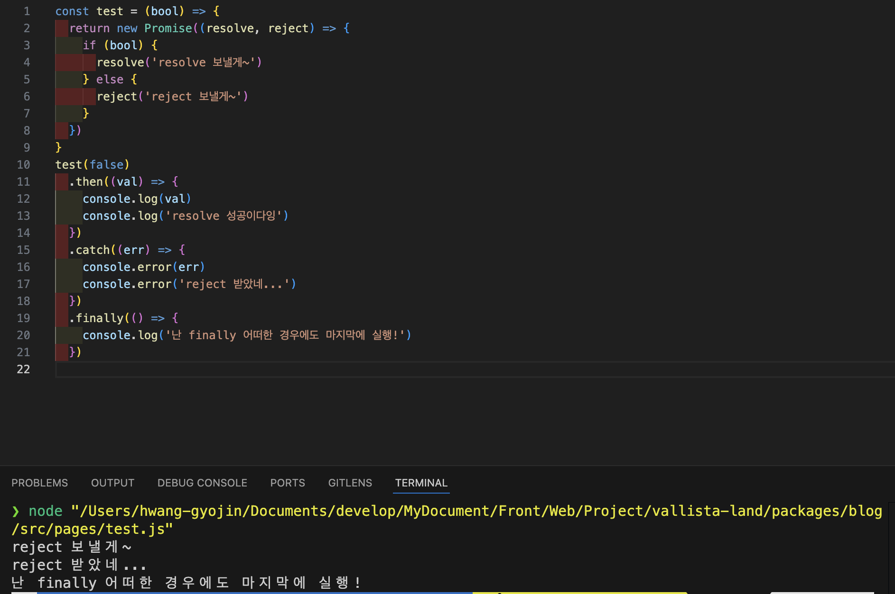
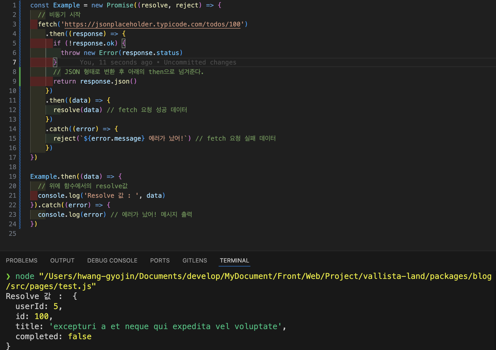

`by Kyojin Hwang`

<br/>

## 📚카테고리 (Category)

- [📌 동기와 비동기](#📌-동기와-비동기)
- [📌 콜백](<#📌-콜백-(Callback)>)
- [📌 프로미스](<#📌-프로미스-(Promise)>)
- [📌 async / await](#📌-async-/-await)
- [📌 반복문 비동기 처리](#📌-반복문-비동기-처리)
- [📌 fetch](#📌-fetch)

## 📌 동기와 비동기

- 동기 (Synchronous) : 순차적으로 코드를 실행 된다.
- 비동기 (Asynchronous) : 순차적으로 코드가 실행 되지않는다.

```javascript {numberLines}
// 동기적
console.log(1)
console.log(2)
console.log(3)
// 1
// 2
// 3

// 비동기적
console.log(1)
setTimeout(() => {
  console.log(2)
}, 1000)
console.log(3)
// 1
// 3
// 2
```

[📚Move](<#📚카테고리-(Category)>)

## 📌 콜백 (Callback)

- 다른 함수가 실행을 끝낸 뒤 실행되는 함수이다.

<br/>

### ⭐️ **CallBack이 필요한 이유**

- 특정 코드가 끝나기 전까지는 다른 코드가 실행되지 않기 위해 쓰인다.

```javascript {numberLines}
// ex) second는 무조건 first 이후 실행되어야한다!
// 콜백 실패
function first1() {
  setTimeout(() => {
    console.log(1)
  }, 1000)
}
function second1() {
  console.log(2)
}
first1()
second1()
// 2
// 1

// 콜백 성공
function first2(callback) {
  setTimeout(() => {
    console.log(1)
    callback()
  }, 1000)
}
function second2() {
  console.log(2)
}
first2(second2)
// 1
// 2
```

### ⭐️ **대표적인 콜백 함수 활용 사례**

- inpa님 블로그 참고

**이벤트리스너 사용**

```javascript {numberLines}
let btn = document.getElementById('button') // 요소 선택
// 이벤트 리스너를 추가해준다.
btn.addEventListener('click', () => {
  // 콜백 함수
  console.log(1)
})
```

**고차함수에 사용**

```javascript {numberLines}
// ex) 배열을 두배씩 곱하여 새로운 배열을 생성하는 콜백함수 만들기
let numbers = [2, 4, 6, 8] // 배열 선언
let double = [] // 빈배열 선언

numbers.forEach((num) => {
  double.push(num * 2)
  // 콜백 함수로 각 요소들 두배로 곱해서 배열에 추간
})

console.log(double) // [4, 8, 12, 16]
```

**서버와 데이터 주고 받을때**

```javascript {numberLines}
fetch('https://jsonplaceholder.typicode.com/users')
  .then((res) => {
    // fetch 메소드가 성공하면 콜백 함수로 response 인자를 받는다.
    return res.json()
    // res 객체의 json 매소드를 호출하여 json 데이터 반환한다.
  })
  .then((data) => {
    // json 메소드가 성공하면 콜백 함수로 data 인자를 받는다.
    console.log(data)
  })
```

### 🔥 **콜백지옥**

- 함수의 매개변수로 넘겨지는 콜백 함수가 계속 반복되어 가독성을 떨어뜨리고 유지보수를 어렵게 만든다.

```javascript {numberLines}
step1(function (value1) {
  step2(function (value2) {
    step3(function (value3) {
      step4(function (value4) {
        step5(function (value5) {
          step6(function (value6) {
            // Do something with value6
          })
        })
      })
    })
  })
})
```

`해결방법`

- Promise 활용
- async/await 활용
- 콜백함수와 결과함수 분리

[📚Move](<#📚카테고리-(Category)>)

## 📌 프로미스 (Promise)

- 비동기 프로그래밍의 기법이다.
- 비동기 메소드에서 동기 메소드처럼 값을 반환 할 수 있다.
- 들여쓰기 코드의 길이를 줄여 가독성을 높인다. ( 콜백지옥에 비하여 )

<br/>

### **🤷‍♂️ Promise 3가지 상태**

**상태**

- 대기(pending): 이행하지도, 거부하지도 않은 초기 상태.
- 이행(fulfilled): 연산이 성공적으로 완료됨.
- 거부(rejected): 연산이 실패함.

**주의점**

- 대기 중인 프로미스는 값과 함께 이행할 수도, 어떤 이유(오류)로 인해 거부될 수도 있다.

### 🤷‍♂️ resolve, reject

**resolve**

- 주어진 값을 이행될 경우 Promise 객체를 반환한다.

**rejecct**

- 주어진 값이 거부 될 경우 Promise 객체를 반환한다.

### 🤷‍♂️ then, catch, finally

**then**

- 두개의 인수를 받는다
  - 첫번째 인수는 fulfilled 상태의 값을 전달
  - 두번째 인수는 rejected 상태의 값을 전달
- 에러를 즉시 처리하지 않을 경우에는 두번째 인수를 사용하지 않고 catch 를 사용한다.
  - 프로미스를 사용할 경우 코드가 길어져서 아래가 복잡해질 경우가 있다.

**catch**

- 프로미스가 거부될 때 사용한다. (에러 처리)

**finally**

- 프로미스를 처리하고 맨 마지막에 호출한다.

<br/>

**예시1**

```javascript {numberLines}
const test = (bool) => {
  return new Promise((resolve, reject) => {
    if (bool) {
      resolve('resolve 보낼게~')
    } else {
      reject('reject 보낼게~')
    }
  })
}
test(false)
  .then((val) => {
    console.log(val)
    console.log('resolve 성공이다잉')
  })
  .catch((err) => {
    console.error(err)
    console.error('reject 받았네...')
  })
  .finally(() => {
    console.log('난 finally 어떠한 경우에도 마지막에 실행!')
  })
```



<center> Test resolve 이미지 </center>



<center> Test reject 이미지 </center>

**예시2**

```javascript {numberLines}
const Example = new Promise((resolve, reject) => {
  // 비동기 시작
  fetch('https://jsonplaceholder.typicode.com/todos/100')
    .then((response) => {
      if (!response.ok) {
        throw new Error(response.status)
      }
      // JSON 형태로 변환 후 아래의 then으로 넘겨준다.
      return response.json()
    })
    .then((data) => {
      resolve(data) // fetch 요청 성공 데이터
    })
    .catch((error) => {
      reject(`${error.message} 에러가 났어!`) // fetch 요청 실패 데이터
    })
})

Example.then((data) => {
  // 위에 함수에서의 resolve값
  console.log('Resolve 값 : ', data)
}).catch((error) => {
  console.log(error) // 에러가 났어! 메시지 출력
})
```



<center> Test then,catch 이미지</center>

### ⭐️ Promise 체이닝 방식

- 여러개의 비동기 작업을 순차적으로 수행할 수 있다.

**예시1**

```javascript {numberLines}
const a = () => {
  return new Promise((resolve) => {
    setTimeout(() => {
      console.log(1)
      resolve()
    }, 1000)
  })
}
const b = () => {
  return new Promise((resolve) => {
    setTimeout(() => {
      console.log(2)
      resolve()
    }, 1000)
  })
}
const c = () => {
  return new Promise((resolve) => {
    setTimeout(() => {
      console.log(3)
      resolve()
    }, 1000)
  })
}

const d = () => console.log(4)

a()
  .then(() => b())
  .then(() => c())
  .then(() => d())
```

**예시2**

```javascript {numberLines}
function doSomething() {
  return new Promise((resolve, reject) => {
    resolve(100)
  })
}

doSomething()
  .then((value1) => {
    const data1 = value1 + 50
    // 150
    return data1
  })
  .then((value2) => {
    // value 2는 위의 data1 값이된다
    const data2 = value2 + 50
    // 200
    return data2
  })
  .then((value3) => {
    // value3은 위의 data2 값이된다.
    const data3 = value3 + 50
    // 250
    return data3
  })
  .then((value4) => {
    // value4 === data3
    console.log(value4) // 250 출력
  })

// 순차적으로 위에서부터 아래로 값을 전달해준다.
```

## 📌 async / await

- 비동기 처리 방식이다.
- `Promise` 기반이다.
- `Promise`보다 코드가 길어질 경우 코드 가독성이 더 좋다.
- `try , catch`를 통한 에러핸들링을 한다.
- `await`은 `async` 안에서만 사용 할 수 있다.

<br/>

**예시**

```javascript {numberLines}
const a = () => {
  return new Promise((resolve) => {
    setTimeout(() => {
      console.log(1)
      resolve()
    }, 1000)
  })
}
const b = () => {
  return new Promise((resolve) => {
    setTimeout(() => {
      console.log(2)
      resolve()
    }, 1000)
  })
}
const c = () => {
  return new Promise((resolve) => {
    setTimeout(() => {
      console.log(3)
      resolve()
    }, 1000)
  })
}

const testAsyncAwait = async () => {
  await a()
  console.log('첫번째!')
  await b()
  console.log('두번째!')
  await c()
  console.log('세번쨰!')
}

testAsyncAwait()
```

### ⭐️ 코드 간소화

- 상단의 만들어 놓은 async await의 코드를 간소화하기

```javascript {numberLines}
// 함수 한개 및 함수에서 인자를 받아서 처리

const testConsole = (clgNumber) => {
  return new Promise((resolve) => {
    setTimeout(() => {
      console.log(clgNumber)
      resolve()
    }, 1000)
  })
}

const testAsyncAwait = async () => {
  await testConsole(1)
  console.log('첫번째!')
  await testConsole(2)
  console.log('두번째!')
  await testConsole(3)
  console.log('세번쨰!')
}

testAsyncAwait()
```

[📚Move](<#📚카테고리-(Category)>)

## 📌 반복문 비동기 처리

```javascript {numberLines}
const getMovies = (movieName) => {
  return new Promise((resolve) => {
    fetch(`https://www.omdbapi.com/?apikey=7035c60c&s=${movieName}`)
      .then((res) => res.json())
      .then((res) => resolve(res))
  })
}

const titles = ['frozen', 'avengers', 'avatar']

// forEach는 배열의 순서대로 출력되지않음
// Promise를 기다리지 않는다 (mdn출처).

titles.forEach(async (title) => {
  const movies = await getMovies(title)
  console.log(title, movies)
})

// 대안 1 for of
const start = async () => {
  for (const title of titles) {
    const movies = await getMovies(title)
    console.log(movies)
  }
}
start()

// 대안 2 Promise all
// 하나라도 실패하면 reject 만 보내준다.
const start2 = async () => {
  // 각 제목에 대해 getMovies 함수를 호출하여 Promise 배열을 생성합니다.
  const movies = await Promise.all(titles.map(getMovies))

  movies.map((data) => {
    console.log(data)
  })
}

start2()

// 대안 3 Promise allSettled
// 실패해도 resolve 된 값과 reject 값을 전체 다보내준다.

const promise1 = new Promise((resolve) => {
  setTimeout(() => {
    resolve(1)
  }, 3000)
})

const promise2 = new Promise((resolve) => {
  setTimeout(() => {
    resolve(2)
  }, 2000)
})

const promise3 = new Promise((resolve, reject) => {
  setTimeout(() => {
    reject(new Error('다 무시하고 에러내버려!'))
  }, 2500)
})

const start3 = () => {
  Promise.allSettled([promise1, promise2, promise3])
    .then((result) => console.log(result.map((el) => el.value ?? '실패값')))
    .catch((e) => console.error(e))
}

start3()
```

[📚Move](<#📚카테고리-(Category)>)

## 📌 fetch

- 네트워크를 통해서 리소스 요청(Request) 및 응답(Response)을 처리할 수 있다.
- Promise 인스턴스를 반환한다.

`대표적인 option`

- method : GET, POST, PUT, DELETE
- headers : 헤더는 요청 및 응답의 주요 속성을 정의하고, 데이터 형식, 인코딩, 캐싱, 인증 및 세션 관리와 같은 중요한 정보를 제공한다.
- body : 필요한 정보를 서버에 보내야할 때 사용

```javascript {numberLines}
// then 방식
const thenApi = () => {
  fetch(`https://api.thecatapi.com/v1/images/search?limit=10`)
    .then((res) => {
      return res.json()
    })
    .then((data) => console.log(data))
}

// async / await 방식
const asyncApi = async () => {
  const res = await fetch(`https://api.thecatapi.com/v1/images/search?limit=${num}`)
  const data = await res.json()
  console.log(data)
}
```

[📚Move](<#📚카테고리-(Category)>)
