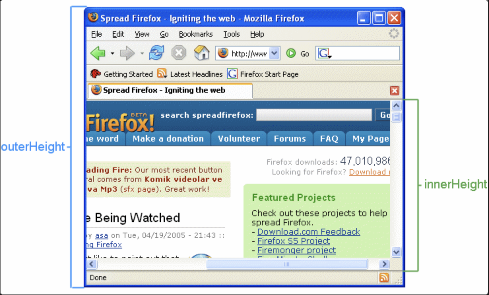

`by Kyojin Hwang`

<br/>

## 📚카테고리 (Category)

- [📌 Window (innerWidth,innerHeigth)](<#📌-Window-(innerWidth,innerHeigth)>)
- [📌 Window (scrollX,scrollY)](<#📌-Window-(scrollX,scrollY)>)
- [📌 Window (scrollTo)](<#📌-Window-(scrollTo)>)
- [📌 E.offsetWidth, E.offsetHeight](#📌-E.offsetWidth,-E.offsetHeight)

## 📌 Window (innerWidth,innerHeigth)

- 현재 화면(Viewport)의 크기를 얻는다.

```javascript {numberLines}
console.log(window.innerWidth)
console.log(window.innerHeight)
```



<center>innerHeight 사진 (width도 동일)</center>

[📚Move](<#📚카테고리-(Category)>)

## 📌 Window (scrollX,scrollY)

- 수평 혹은 수직의 스크롤을 얻는다.
- 현재 화면(viewport)의 기준이다.

```javascript {numberLines}
console.log(window.scrollX)
console.log(window.scrollY)
```

## 📌 Window (scrollTo)

- window.scrollTo / E.scrollTo
- 지정된 좌표로 스크롤 합니다.

<br/>

`사용방법 (window, E 둘다포함)`

- 대상.scrollTo(X좌표, Y좌표)
- 대상.scrollTo({ top: Y좌표, left: X좌표, behavior: 'smooth' })

```javascript {numberLines}
window.scrollTo(0, 500)
window.scrollTo({ top: 500, behavior: 'smooth' })
```

[📚Move](<#📚카테고리-(Category)>)

## 📌 E.offsetWidth, E.offsetHeight

- 테두리 선을 포함한 요소의 크기

```javascript {numberLines}
const testEl = document.querySelecotr('.test')

const width = testEl.offsetWidth
const height = testEl.offsetHeight
```

[📚Move](<#📚카테고리-(Category)>)
