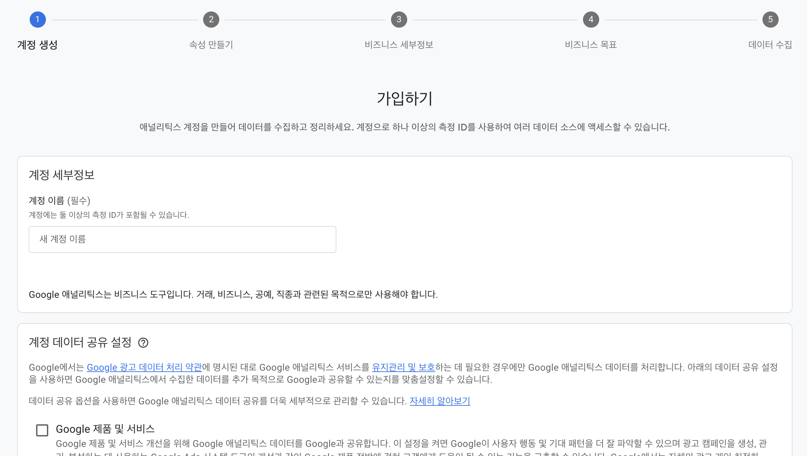
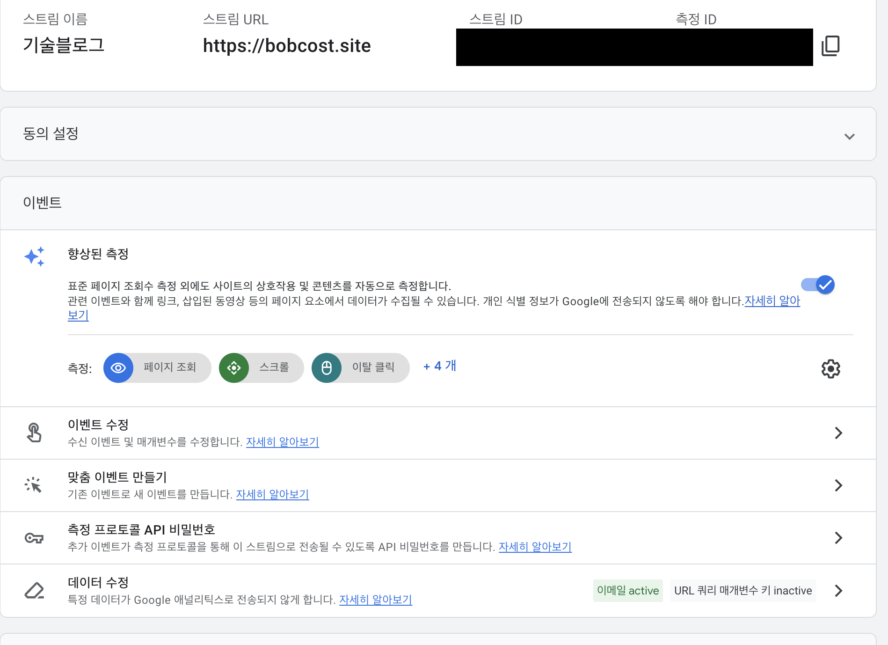

### 1. 구글 애널리틱스 계정생성 및 데이터 스트림



<center>사이트 보고서 받을 계정생성 (사진)</center>



<center>측정 ID를 받기위한 스트림(사진)</center>

### 2. 플러그인 설치

```bash ${numberLines}
yarn add gatsby-plugin-google-analytics
```

### 3. gatsby-config 수정 및 배포

```javascript {numberLines}
module.exports = {
  plugins: [
    {
      resolve: `gatsby-plugin-google-analytics`,
      options: {
        trackingId: '측정ID',
        head: false,
        anonymize: true,
        respectDNT: true,
        pageTransitionDelay: 0,
        defer: false,
        sampleRate: 5,
        siteSpeedSampleRate: 10,
        cookieDomain: 'bobcost.site'
      }
    }
  ]
}
```
